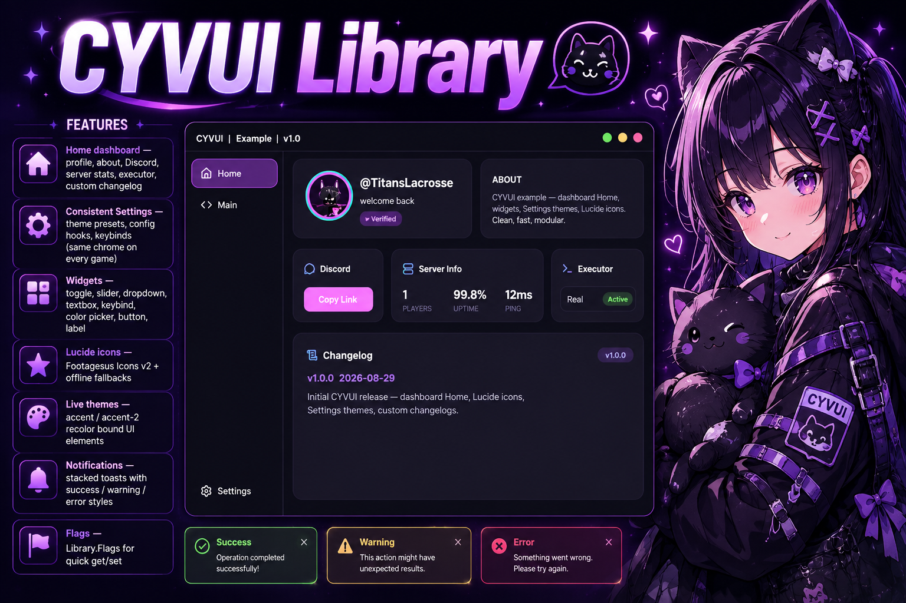
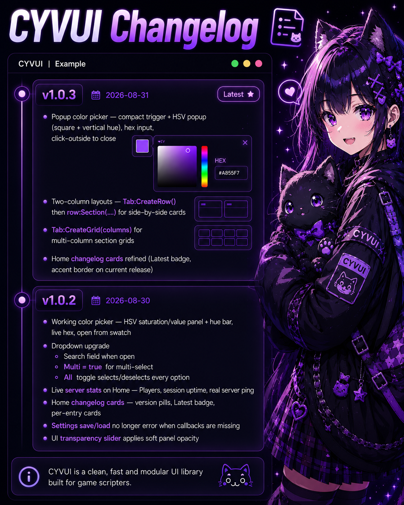

# CYVUI





**Full history:** [CHANGELOG.md](./CHANGELOG.md)


Dark modern Roblox UI library for script hubs. Dashboard-style **Home**, shared **Settings**, Lucide icons, live theme presets.


---

## Features

- **Home dashboard** — profile, about, Discord, server stats, executor, custom changelog
- **Consistent Settings** — theme presets, config hooks, keybinds (same chrome on every game)
- **Widgets** — toggle, slider, dropdown, textbox, keybind, color picker, button, label
- **Lucide icons** — Footagesus Icons v2 + offline fallbacks
- **Live themes** — accent / accent-2 recolor bound UI elements
- **Notifications** — stacked toasts with success / warning / error styles
- **Flags** — `Library.Flags` for quick get/set

Home and Settings stay the same layout across games — only text, stats, and changelog entries change.

---

## Install

```lua
local Library = loadstring(game:HttpGet("https://raw.githubusercontent.com/urmoit/CYVUILibrary/main/Library.lua"))()
```

Or drop `Library.lua` into your project and require / loadstring the file.

---

## Quick start

```lua
local Library = loadstring(game:HttpGet("https://raw.githubusercontent.com/urmoit/CYVUILibrary/main/Library.lua"))()

local Window = Library:CreateWindow({
    Title    = "CYVHUB",
    GameName = "My Game",
    Version  = "v1.0.3",
})

local Home = Window:CreateTab({ Name = "Home", Icon = "house", Home = true })
Home:CreateHomeLayout({
    Username     = game.Players.LocalPlayer.DisplayName,
    Welcome      = "welcome back",
    AboutText    = "Your hub description.",
    DiscordLink  = "https://discord.gg/vTe3sNTsDM",
    ExecutorName = identifyexecutor and identifyexecutor() or "Unknown",
    Changelog    = {
        { Version = "v1.0.3", Date = "2026-08-29", Text = "Notification redesign." },
    },
})

local Main = Window:CreateTab({ Name = "Main", Icon = "layout" })
local Combat = Main:CreateSection("Combat", { Icon = "swords" })
Combat:AddToggle({
    Text = "Aimbot",
    Flag = "Aimbot",
    Callback = function(value)
        print("Aimbot:", value)
    end,
})

Library:Notify("CYVUI", "Loaded.", 3, "success")
```

Full API and more examples: **[DOCS.md](./DOCS.md)** · runnable demo: **[Example.lua](./Example.lua)**

---

## Structure

```
CYVUI/
├── Library.lua   -- core UI library
├── Example.lua   -- full demo script
├── DOCS.md       -- API reference + examples
└── README.md
```

---

## Controls

| Input | Action |
|-------|--------|
| Right Control | Toggle UI visibility |
| Title bar drag | Move window |
| Yellow traffic light | Minimize / restore |
| Red traffic light | Destroy UI |

---

## Theme

Default palette (dashboard mockup):

| Token | Color |
|-------|--------|
| Background | `#0a0a0d` |
| Panel | `#18181e` |
| Accent | `#8b5cf6` |
| Accent 2 | `#22d3ee` |

Change at runtime:

```lua
Library:SetTheme(
    Color3.fromRGB(244, 114, 182), -- accent
    Color3.fromRGB(251, 146, 60)   -- accent2
)
```

Or use the built-in Settings → Theme swatches.

---

## Lucide icons

Pass Lucide icon names into tabs and sections:

```lua
Window:CreateTab({ Name = "Main", Icon = "layout" })
tab:CreateSection("Player", { Icon = "user" })
```

Browse names at [lucide.dev/icons](https://lucide.dev/icons). Icons resolve via Footagesus Icons v2 with local rbxassetid fallbacks.

---

## Discord

https://discord.gg/vTe3sNTsDM

---


## Changelog

See **[CHANGELOG.md](./CHANGELOG.md)** for every release. The image under the banner shows the two latest versions.


## License

MIT — use in hubs, paid scripts, or personal projects. Credit appreciated, not required.
